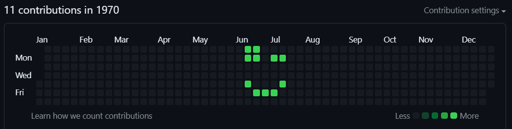

# commit canvas cli

`deno run --allow-run jsr:@despacito/commit-canvas-cli -- 1970-06-14 1 3 3 1 4 7 3 4 3 3`

## Usage

1. create a new folder
2. cd into it / open terminal inside
3. run
4. push repository to github
